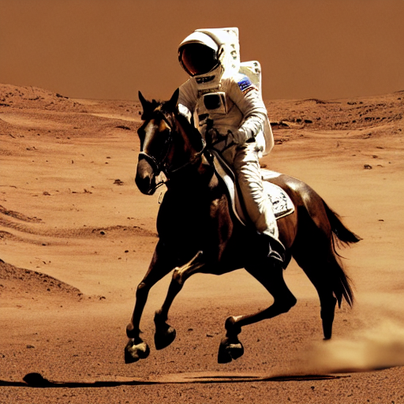
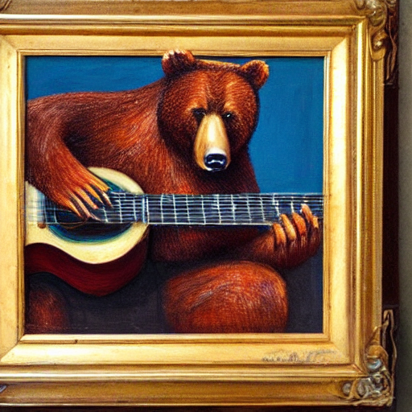

# stable_diffusion_huggingface

## Stable Diffusion using huggingface

The [code](https://github.com/CompVis/stable-diffusion) and [model](https://huggingface.co/CompVis) come from CompVis and huggingface. 

I use the [models](https://huggingface.co/CompVis/stable-diffusion-v1-4) listed in huggingface hub.

Thanks a lot for their great efforts!


## Dependencies Installation

- [torch whl cpu/cu](https://download.pytorch.org/whl/torch_stable.html) download

- [transformers](https://huggingface.co/transformers/v2.5.1/installation.html)  [ installation](https://huggingface.co/docs/transformers/installation)

## Run

```
write a sentence in the code

python stable_diffusion_huggingface.py
```

## Examples

a photo of an astronaut riding a horse on mars



a bear is playing guitar, oil on canvas

